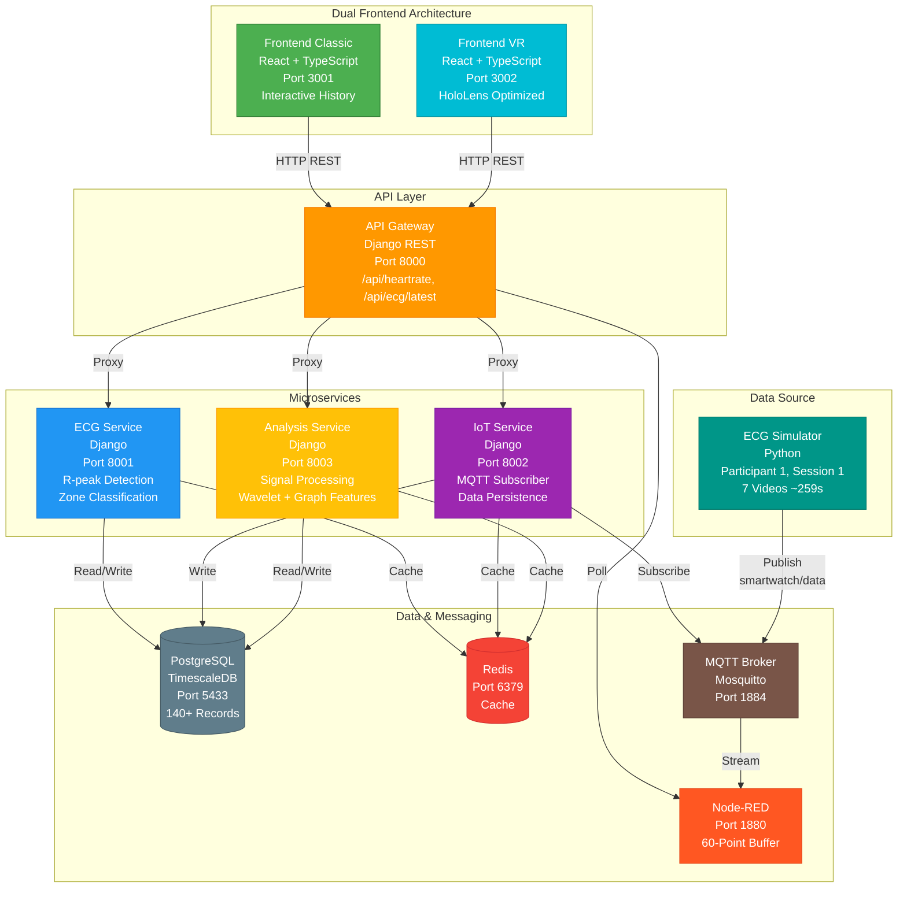

# XR ECG Twin - Real-Time ECG Monitoring System

A modern, scalable ECG monitoring system built with Django microservices, MQTT, Node-RED, and dual frontend (Classic Web + HoloLens VR). Features real-time ECG visualization, heart rate zones, and persistent data storage.

## Architecture



## Complete Setup Guide (For Beginners)

### Prerequisites

You'll need to install the following software before starting:

#### For Windows:
1. **GitHub Desktop**: Download from [desktop.github.com](https://desktop.github.com/) (GUI for Git - No terminal needed!)
2. **Docker Desktop**: Download from [docker.com](https://www.docker.com/products/docker-desktop/)
3. **VS Code**: Download from [code.visualstudio.com](https://code.visualstudio.com/) (Has built-in terminal)

#### For Mac:
1. **GitHub Desktop**: Download from [desktop.github.com](https://desktop.github.com/) (GUI for Git - No terminal needed!)
2. **Docker Desktop**: Download from [docker.com](https://www.docker.com/products/docker-desktop/)
3. **VS Code**: Download from [code.visualstudio.com](https://code.visualstudio.com/) (Has built-in terminal)

---

### Step 1: Install GitHub Desktop (GUI - No Terminal Required)

#### Windows:
1. Go to https://desktop.github.com/
2. Click "Download for Windows"
3. Run the installer (GitHubDesktopSetup.exe)
4. It will install automatically - no configuration needed!
5. Open GitHub Desktop from Start Menu
6. Click "Sign in to GitHub.com" (or skip if you don't have an account)

#### Mac:
1. Go to https://desktop.github.com/
2. Click "Download for macOS"
3. Open the downloaded file and drag GitHub Desktop to Applications
4. Open GitHub Desktop from Applications
5. Click "Sign in to GitHub.com" (or skip if you don't have an account)

**Why GitHub Desktop?**
- Visual interface - no terminal commands needed
- Easy repository cloning with one click
- See file changes visually
- Commit and sync with buttons

---

### Step 2: Install Docker Desktop

#### Windows:
1. Download Docker Desktop from https://www.docker.com/products/docker-desktop/
2. Run the installer
3. **Important**: Enable WSL 2 if prompted (Windows Subsystem for Linux)
4. Restart your computer when asked
5. Open Docker Desktop - wait for it to start (may take a few minutes)
6. You should see a green "Docker Desktop is running" status

#### Mac:
1. Download Docker Desktop from https://www.docker.com/products/docker-desktop/
2. Open the `.dmg` file and drag Docker to Applications
3. Open Docker from Applications folder
4. Grant permissions if asked
5. Wait for Docker to start (green light in menu bar)
6. You should see "Docker Desktop is running" status

**Verify Docker Installation:**
```bash
docker --version
docker-compose --version
```

---

### Step 3: Clone the Project (Using GitHub Desktop - GUI Method)

#### Method A: Clone with GitHub Desktop (Recommended - No Terminal!)

1. **Open GitHub Desktop**
2. **Click "File" → "Clone Repository"**
3. **Click "URL" tab**
4. **Enter the repository URL:**
   ```
   https://github.com/do3-173/XR_ECG_Twin.git
   ```
5. **Choose where to save it:**
   - Windows: `C:\Users\YourName\Documents\XR_ECG_Twin`
   - Mac: `/Users/YourName/Documents/XR_ECG_Twin`
6. **Click "Clone"** - wait for download to complete (shows progress bar)
7. **When done, click "Open in Visual Studio Code"** button

#### Method B: Download ZIP (If you don't want to use Git at all)

1. Go to https://github.com/do3-173/XR_ECG_Twin
2. Click green "Code" button → "Download ZIP"
3. Extract the ZIP file to your Documents folder
4. Right-click the extracted folder → "Open with Code" (if you have VS Code installed)

**Tip:** GitHub Desktop automatically tracks changes and makes updating the project easy with one click!

---

### Step 4: Start the Application (Using VS Code Terminal)

#### Step 4.1: Open Project in VS Code

**If you used GitHub Desktop:**
- Click "Open in Visual Studio Code" button in GitHub Desktop

**If you downloaded ZIP:**
- Right-click the project folder → "Open with Code"
- Or open VS Code → File → Open Folder → Select XR_ECG_Twin folder

#### Step 4.2: Open Integrated Terminal in VS Code

1. In VS Code, press **Ctrl + `** (backtick key, usually next to number 1)
2. Or go to: **View → Terminal**
3. A terminal panel will open at the bottom of VS Code

#### Step 4.3: Start Docker Desktop

1. **Windows**: Click Start Menu → Docker Desktop
2. **Mac**: Click Applications → Docker Desktop
3. Wait for Docker to show "Docker Desktop is running" (green status)
4. You can minimize Docker Desktop - it just needs to be running in background

#### Step 4.4: Build and Run All Services

In the VS Code terminal at the bottom, type:

```bash
docker-compose up --build
```

**What happens:**
- First time: Downloads ~2GB of images and builds everything (5-10 minutes)
- You'll see lots of colorful text scrolling - this is normal!
- Wait until text slows down and you see log messages from services
- Look for messages like "frontend_1", "gateway_1", "simulator_1" - means they're running

**Tip:** Don't close the VS Code terminal window while the application is running!

---

### Step 5: Access the Application

Once all services are running (text in terminal has slowed down), open your web browser:

- **Main Dashboard (Classic)**: http://localhost:3001
- **VR Interface (HoloLens)**: http://localhost:3002
- **Node-RED Dashboard**: http://localhost:1880
- **API Gateway**: http://localhost:8000/api/heartrate

**What you should see:**
- Real-time ECG waveform visualization
- Current heart rate with zone indicator
- 60-second history graph with colored zones
- Data updating every second

---

### Step 6: Stop the Application

#### Method 1: Using VS Code Terminal (Recommended)
1. Click on the terminal panel in VS Code (where docker-compose is running)
2. Press **Ctrl + C** (Windows/Linux) or **Cmd + C** (Mac)
3. Wait 10-15 seconds for all services to stop gracefully
4. You'll see "Stopping..." messages and then return to command prompt

#### Method 2: Using Docker Desktop GUI
1. Open Docker Desktop
2. Click "Containers" in the left sidebar
3. Find the "xr_ecg_twin" container group
4. Click the "Stop" button (square icon)
5. Wait for all containers to show "Exited" status

#### Method 3: Force Stop Everything
If containers won't stop, open a new terminal in VS Code:
1. Press **Ctrl + Shift + `** (opens new terminal tab)
2. Type: `docker-compose down`
3. Press Enter

---

### Step 7: Restart Later (Quick Start)

After the initial setup, starting is much faster (30 seconds instead of 10 minutes):

#### Using VS Code (Easiest Way):
1. **Open VS Code**
2. **File → Open Recent → XR_ECG_Twin** (it remembers your projects!)
3. **Open terminal**: Press **Ctrl + `**
4. **Make sure Docker Desktop is running** (check system tray/menu bar)
5. **Type:** `docker-compose up`
6. **Wait 30 seconds** until services are ready
7. **Open browser:** http://localhost:3001

#### Using Docker Desktop GUI:
1. Open Docker Desktop
2. Click "Containers" in left sidebar
3. Find "xr_ecg_twin" container group
4. Click the "Play" button (triangle icon) to start all services
5. Open browser: http://localhost:3001

#### Running in Background (No Terminal Window):
In VS Code terminal, type:
```bash
docker-compose up -d
```
The `-d` means "detached" - services run in background. To stop later:
```bash
docker-compose down
```

## Services Overview

### Frontend Classic (Port 3001)
- React 18 web interface
- Real-time ECG visualization (1200x300px)
- Heart rate history with zone colors (1200x400px)
- Interactive features: clickable history points with tooltips
- Hover effects showing exact BPM values
- Grid lines, time labels, and enhanced rendering

### Frontend VR (Port 3002)
- HoloLens-optimized React interface
- Dark theme with cyan accents (#00d4ff)
- Three-view navigation system:
  - **Overview**: 3-card grid (HR/Zone/Time) + mini ECG
  - **ECG View**: Full-screen ECG visualization (1000x500px)
  - **History View**: Full-screen history chart (1000x500px)
- Larger touch targets (60px min-height) for gesture control
- Glow effects and backdrop blur for AR visibility
- View selector buttons with active state styling

### API Gateway (Port 8000)
- Central entry point for all API requests
- Aggregates data from Node-RED and IoT service
- Provides unified endpoints for frontends

**Endpoints:**
- `GET /api/heartrate/` - Latest heart rate with 60-point history and ECG samples
- `GET /api/ecg/latest/` - Latest ECG reading
- `GET /api/status/` - System status

### Node-RED (Port 1880)
- Real-time data processing and flow management
- 60-point rolling buffer for heart rate history
- Calculates statistics (min/max/avg heart rate)
- Exposes HTTP endpoints consumed by gateway
- Web-based flow editor for easy modifications

### ECG Simulator
- Python-based smartwatch data simulator
- Publishes to MQTT topic: `smartwatch/data`
- Uses real ECG dataset from Sapienza research
- Configurable via environment variables:
  - `PARTICIPANT=1` (participant ID 1-10)
  - `SESSION=1` (session number)
  - `MAX_VIDEOS=7` (all 7 video recordings ~259 seconds)
- Generates realistic ECG samples (128 Hz) with heart rate

### ECG Service (Port 8001)
- Django REST service for ECG processing
- R-peak detection algorithms
- Heart rate zone classification (0-5 zones)
- Feature extraction capabilities
- Historical data analysis

**Heart Rate Zones:**
- Zone 0: Below normal (< 40 BPM)
- Zone 1: Rest (40-60 BPM)
- Zone 2: Light activity (61-90 BPM)
- Zone 3: Moderate activity (91-110 BPM)
- Zone 4: Intense activity (111-130 BPM)
- Zone 5: Maximum effort (131+ BPM)

**Endpoints:**
- `GET /api/ecg/latest/` - Get latest ECG reading
- `POST /api/ecg/process/` - Process new ECG data

### IoT Service (Port 8002)
- MQTT subscriber listening to `smartwatch/data` topic
- Persists ECG data to PostgreSQL TimescaleDB
- Device and SensorData models
- **Status:** Currently storing 140+ records successfully
- Converts MQTT messages to database records in real-time

**Models:**
- `Device`: Stores device information (device_id, type, name, is_active)
- `SensorData`: Stores ECG readings (device FK, heart_rate, zone, timestamp, ecg_samples JSON)

**Endpoints:**
- `GET /api/devices/` - List registered devices
- `GET /api/sensor-data/` - Query stored sensor data

### Analysis Service (Port 8003)
- Django REST service for advanced ECG signal processing
- Implements MATLAB-translated algorithms (Python)
- Multi-scale wavelet decomposition (SWT ~ MODWT)
- Graph-theoretic feature extraction
- Job-based processing with UUID tracking

**Features:**
- **Autocorrelation Analysis:** Periodicity detection, decay rate, first min/peak lag
- **Wavelet Features:** Energy distribution, entropy, cross-correlation matrix (6x6)
- **Graph Features:** Network topology metrics (density, clustering, centrality)

**Algorithms:**
- Signal autocorrelation (FFT-based, O(N log N))
- Stationary Wavelet Transform (sym4, db4 wavelets)
- Adjacency matrix construction with thresholding
- NetworkX graph analysis

**Endpoints:**
- `POST /api/analysis/process/` - Analyze ECG signal (128-100000 samples)
- `GET /api/analysis/result/<job_id>/` - Get analysis result by job ID
- `GET /api/analysis/latest/` - Get latest result (filter by device/participant)
- `GET /api/analysis/jobs/` - List all analysis jobs
- `GET /api/analysis/health/` - Service health check

**Performance:**
- Excellent: < 2 seconds for 5000 samples (~39s ECG)
- Typical: 2-35 ms for 2000 samples
- Redis caching (3600s TTL) for repeated queries

## Development

### Local Development (Without Docker)

#### 1. Setup Gateway
```bash
cd gateway
python3 -m venv venv
source venv/bin/activate
pip install -r requirements.txt
python manage.py migrate
python manage.py runserver 8000
```

#### 2. Setup ECG Service
```bash
cd services/ecg_service
python3 -m venv venv
source venv/bin/activate
pip install -r requirements.txt
python manage.py migrate
python manage.py runserver 8001
```

#### 3. Setup IoT Service
```bash
cd services/iot_service
python3 -m venv venv
source venv/bin/activate
pip install -r requirements.txt
python manage.py migrate
python manage.py runserver 8002
```

#### 4. Setup Analysis Service
```bash
cd services/ecg_analysis_service
python3 -m venv venv
source venv/bin/activate
pip install -r requirements.txt
python manage.py makemigrations
python manage.py migrate
python manage.py runserver 8003
```

#### 5. Start Supporting Services
```bash
# PostgreSQL
docker run -d -p 5432:5432 -e POSTGRES_PASSWORD=ecg_password timescale/timescaledb:latest-pg15

# Redis
docker run -d -p 6379:6379 redis:7-alpine

# Mosquitto MQTT
docker run -d -p 1883:1883 -p 9001:9001 eclipse-mosquitto:2
```

### Frontend Development
```bash
cd frontend
npm install
npm start
```

## Technology Stack

### Backend
- **Django 4.2** - Web framework for microservices
- **Django REST Framework** - API development
- **PostgreSQL + TimescaleDB** - Time-series database for ECG data
- **Redis 7** - Cache and session storage
- **MQTT (Eclipse Mosquitto 2)** - IoT messaging protocol
- **Node-RED** - Visual flow-based programming for data pipelines
- **Python 3.10** - Primary backend language

### Signal Processing
- **NumPy 1.24** - Numerical computing and array operations
- **SciPy 1.10** - Signal processing and filtering
- **paho-mqtt 1.6** - MQTT client library
- Custom ECG processor adapted from Sapienza research

### Frontend
- **React 18** - UI framework for both classic and VR interfaces
- **TypeScript** - Type-safe JavaScript
- **Canvas API** - High-performance ECG rendering
- **CSS3** - Responsive styling with animations

### DevOps
- **Docker & Docker Compose** - Containerization and orchestration
- **Nginx** - Reverse proxy for frontend services
- **Git** - Version control

## MQTT Topics

```
smartwatch/data    - Real-time ECG data from simulator
                     Payload: {
                       "timestamp": float,
                       "heart_rate": int,
                       "zone": int (0-5),
                       "ecg_samples": [128 float values],
                       "source": "ECGdata_s1p1v1.dat",
                       "participant": 1
                     }

smartwatch/status  - Device status updates
```

## Data Flow

1. **Simulator → MQTT**: Python simulator publishes ECG data (128 Hz) to `smartwatch/data` topic every 1 second
2. **MQTT → Node-RED**: Node-RED subscribes and buffers last 60 data points
3. **MQTT → IoT Service**: Django MQTT client subscribes and persists to PostgreSQL (140+ records stored)
4. **Node-RED → Gateway**: Gateway polls Node-RED HTTP endpoints (`/heartrate`) every second
5. **Gateway → Frontend**: Both frontends (Classic & VR) poll gateway `/api/heartrate` every 1 second
6. **Frontend Rendering**: 
   - Canvas-based ECG visualization
   - Real-time heart rate updates
   - Interactive history with tooltips
   - Zone-colored backgrounds

## Testing MQTT

```bash
# Subscribe to simulator data
mosquitto_sub -h localhost -p 1884 -t "smartwatch/data"

# Check IoT service logs for MQTT messages
docker logs ecg_iot_service --follow

# Verify data in PostgreSQL
docker exec -it ecg_postgres psql -U ecg_user -d ecg_db -c "SELECT COUNT(*) FROM iot_sensordata;"
```

## Docker Commands

```bash
# Start all services
docker-compose up -d

# View logs for specific service
docker-compose logs -f simulator
docker-compose logs -f iot-service
docker-compose logs -f frontend

# Stop services
docker-compose down

# Rebuild specific service
docker-compose build simulator
docker-compose restart simulator

# Rebuild frontend after code changes
docker-compose build frontend
docker-compose stop frontend
docker-compose rm -f frontend
docker-compose up -d frontend

# Run Django migrations
docker-compose exec gateway python manage.py migrate
docker-compose exec ecg-service python manage.py migrate
docker-compose exec iot-service python manage.py migrate

# Check service status
docker ps

# View frontend logs
docker logs ecg_frontend --tail 50
docker logs ecg_frontend_vr --tail 50
```

## Environment Configuration

The simulator and services can be configured via `docker-compose.yml` environment variables:

### Simulator Configuration
```yaml
environment:
  - MQTT_BROKER=mqtt          # MQTT broker hostname
  - MQTT_PORT=1883            # MQTT port (internal)
  - PARTICIPANT=1             # Participant ID (1-10)
  - SESSION=1                 # Session number
  - MAX_VIDEOS=7              # Number of video files to use (1-7)
  # - RANDOM_PARTICIPANTS=1   # Uncomment for random participant selection
```

**Current Setup:** Participant 1, Session 1, 7 videos = ~259 seconds of consistent ECG data before looping

### Security Notes

**Before production:**
1. Change `POSTGRES_PASSWORD` in docker-compose.yml
2. Generate new `SECRET_KEY` for Django services
3. Set `DEBUG=False` in Django settings
4. Configure `ALLOWED_HOSTS` properly
5. Enable MQTT authentication (update mosquitto.conf)
6. Use HTTPS/WSS for frontend
7. Add authentication to API endpoints

## Monitoring

- **Health endpoints**: Each service has `/health/` endpoint
- **Logs**: `docker compose logs -f <service>`
- **Database**: Connect to PostgreSQL on port 5432
- **Redis**: Use `redis-cli` on port 6379

## Contributing

This is a university project (Sapienza - Software Engineering).

## License

MIT License

## Project Structure

```
XR_ECG_Twin/
├── docker-compose.yml          # Orchestrates 11 services
├── .dockerignore               # Excludes files from Docker build
├── README.md                   # This file
├── private_folder/             # Documentation and session notes
│   ├── MATLAB_MIGRATION_PLAN.md
│   ├── MATLAB_ALGORITHMS_TECHNICAL_DOC.md
│   ├── SESSION_NOTES.md
│   ├── DEPLOYMENT.md
│   └── MIGRATION_COMPLETE.md
│
├── gateway/                    # API Gateway Service (Port 8000)
│   ├── Dockerfile
│   ├── requirements.txt
│   ├── manage.py
│   ├── gateway/
│   │   ├── settings.py
│   │   └── urls.py
│   └── api/
│       ├── views.py            # Aggregates Node-RED + IoT data
│       └── urls.py
│
├── services/
│   ├── ecg_service/           # ECG Processing Service (Port 8001)
│   │   ├── Dockerfile
│   │   ├── requirements.txt
│   │   ├── manage.py
│   │   ├── ecg_service/
│   │   │   └── settings.py
│   │   └── ecg/
│   │       ├── models.py
│   │       ├── views.py
│   │       └── ecg_processor.py
│   │
│   └── iot_service/           # IoT/MQTT Service (Port 8002)
│       ├── Dockerfile
│       ├── requirements.txt
│       ├── manage.py
│       ├── iot_service/
│       │   └── settings.py
│       └── iot/
│           ├── models.py       # Device, SensorData models
│           ├── views.py
│           ├── mqtt_client.py  # MQTT subscriber (140+ records stored)
│           └── management/
│               └── commands/
│                   └── start_mqtt_subscriber.py
│
├── simulator/                  # ECG Data Simulator
│   ├── Dockerfile
│   ├── entrypoint.sh           # Configurable startup script
│   └── requirements.txt
│
├── nodered/                    # Node-RED Configuration
│   ├── Dockerfile
│   ├── flows.json              # Data processing flows
│   └── settings.js
│
├── mqtt/                       # MQTT Broker Config
│   ├── config/
│   │   └── mosquitto.conf     # Port 1884 (external)
│   ├── data/
│   └── log/
│
├── frontend/                   # Classic Web Frontend (Port 3001)
│   ├── Dockerfile
│   ├── nginx.conf
│   ├── package.json
│   ├── public/
│   └── src/
│       ├── App.tsx             # Main component with enhanced features
│       ├── App.css             # Styling with zone colors
│       └── index.tsx
│
├── frontend-vr/               # HoloLens VR Frontend (Port 3002)
│   ├── Dockerfile
│   ├── nginx.conf
│   ├── package.json
│   ├── public/
│   │   └── index.html         # HoloLens metadata
│   └── src/
│       ├── App-VR.tsx         # Three-view VR interface
│       ├── App-VR.css         # Dark theme, cyan accents
│       └── index.tsx
│
├── ecg_processor.py           # Shared ECG processing logic
├── smartwatch_simulator.py    # Simulator main script
├── config.py                  # Shared configuration
└── dataset/                   # ECG dataset from Sapienza research
    └── Raw Data/
        └── Multimodal/
            └── ECG/           # ECGdata_s1p1v1-7.dat files
```

## Current Status 

**All Services Running:**
1. **PostgreSQL** (Port 5433) - TimescaleDB with ECG data
2. **Redis** (Port 6379) - Cache and sessions
3. **MQTT Broker** (Port 1884) - Eclipse Mosquitto
4. **Node-RED** (Port 1880) - Data processing with 60-point buffer
5. **Simulator** - Publishing ECG data (Participant 1, 7 videos)
6. **Gateway** (Port 8000) - API aggregation
7. **ECG Service** (Port 8001) - ECG processing
8. **IoT Service** (Port 8002) - MQTT persistence (140+ records)
9. **Analysis Service** (Port 8003) - Signal processing (autocorr, wavelet, graph)
10. **Frontend Classic** (Port 3001) - Web interface with enhanced features
11. **Frontend VR** (Port 3002) - HoloLens-optimized interface

**Features Implemented:**
- Real-time ECG visualization with canvas rendering
- Interactive heart rate history (clickable points, tooltips)
- Zone-colored backgrounds (6 heart rate zones)
- MQTT data persistence to PostgreSQL
- Advanced ECG analysis (autocorrelation, wavelet decomposition, graph features)
- MATLAB algorithm translation to Python (signal processing)
- Dual frontend architecture (Classic + VR)
- HoloLens optimization (dark theme, gesture-friendly UI)
- Configurable simulator (environment variables)

## Troubleshooting

### Frontend not showing updates
1. Hard refresh browser: `Ctrl+Shift+R` (Linux/Windows) or `Cmd+Shift+R` (Mac)
2. Rebuild frontend container:
   ```bash
   docker-compose build frontend
   docker-compose stop frontend && docker-compose rm -f frontend
   docker-compose up -d frontend
   ```

### Simulator not generating data
```bash
# Check simulator logs
docker logs ecg_simulator --follow

# Restart simulator
docker-compose restart simulator

# Verify MQTT broker is receiving data
mosquitto_sub -h localhost -p 1884 -t "smartwatch/data"
```

### IoT service not storing data
```bash
# Check IoT service logs
docker logs ecg_iot_service --follow

# Verify PostgreSQL connection
docker exec -it ecg_postgres psql -U ecg_user -d ecg_db

# Check sensor data count
docker exec -it ecg_postgres psql -U ecg_user -d ecg_db -c "SELECT COUNT(*) FROM iot_sensordata;"
```

### Port conflicts
```bash
# Check which ports are in use
sudo lsof -i :3001
sudo lsof -i :8000

# Edit docker-compose.yml to change port mappings
# Example: Change "3001:80" to "3011:80"
```

### Clean Docker resources
```bash
# Remove all stopped containers
docker container prune -f

# Remove unused images
docker image prune -a -f

# Remove unused volumes
docker volume prune -f

# Complete cleanup
docker system prune -a -f
```

## Features Highlights

### Classic Frontend
- **Interactive History**: Click on any point to see exact BPM value with tooltip
- **Hover Effects**: Orange highlights on hover for better UX
- **Zone Colors**: Background colors change based on heart rate zones
- **Grid Lines**: Horizontal BPM grid lines (40, 60, 90, 110, 130, 150)
- **Time Labels**: Shows -60s, -45s, -30s, -15s, now
- **Enhanced ECG**: Subtle grid, gradient coloring, shadow effects

### VR Frontend
- **Three Views**: Switch between Overview, ECG, and History
- **Dark Theme**: Optimized for AR overlay visibility
- **Cyan Accents**: High-contrast colors (#00d4ff) for mixed reality
- **Larger Targets**: 60px minimum height for hand gesture interaction
- **Glow Effects**: CSS glow and backdrop blur for depth
- **Persistent Footer**: Quick stats always visible
- **View Selector**: Easy navigation with active state indicators

### Backend
- **MQTT Persistence**: All data automatically stored in TimescaleDB
- **Real-time Processing**: Node-RED buffers and processes data streams
- **Configurable Simulator**: Easy to change participant and session data
- **Microservices**: Independent scaling of each service
- **RESTful APIs**: Clean JSON endpoints for all frontends


